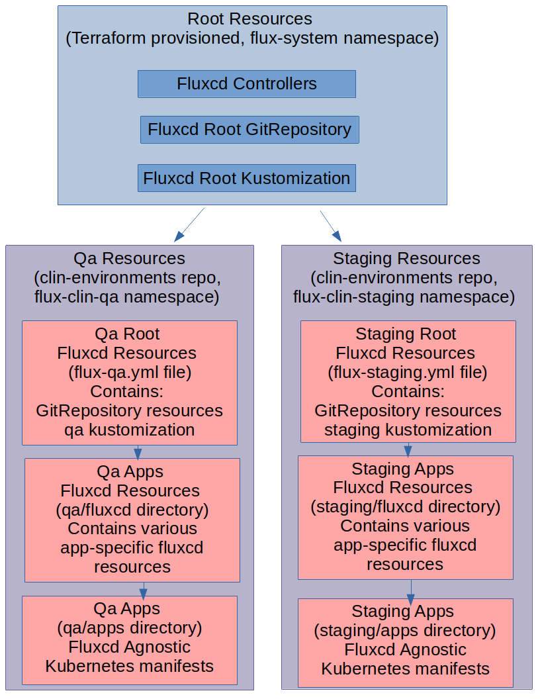

# About

This repo holds kubernetes orchestration for the pre-prod environments of the clin project.

# Dependencies

This repo is dependent on the following repos:
- A common orchestration repo: https://github.com/Ferlab-Ste-Justine/cqdg-orchestrations
- A terraform boostrap repo: https://github.com/Ferlab-Ste-Justine/cqdg-infra-kubernetes/tree/main/clin-qa-orchestration

The common orchestration repo holds common base orchestrations for various applications that can be adapted to the needs of specific projects with **kustomize**.

The terraform bootstrap repo, beyond provisioning the kubernetes cluster itself, passes various external resources from terraform to kubernetes and also bootstraps fluxcd.

# Repo Directories Maps

- **Root kustomize manifest files**: These manifest files are referenced by the root fluxcd resources created by terraform. These files container the orchestration for top-level fluxcd resources per environment (in their respective namespace). Because both the **qa** and **staging** environments are on the same kubernetes cluster (and it is best practice for flux v2 not to run more than once instance of the flux controllers), their top level fluxcd resources are orchestrated in a unified **kustomize** orchestration, but should the environments become separated in separate kubernetes clusters later on, they could be orchestrated in separate **kustomize** orchestrations.
- **qa**: This directory contains the kubernetes orchestration specific to the qa environment
  - **fluxcd**: This directory contains all the fluxcd specific resources (kustomizations, image repositories, image policies and image automations) necessary to manage the applications
  - **apps**: This directory contains **fluxcd** agnostic **kustomize** orchestration for the various services. Each directory is a standalone orchestration per application. Except for the tags to indicate which images to auto-update, there should be no reference to **fluxcd** in this directory.
- **staging**: This directory contains the kubernetes orchestration specific to the staging environment
  - **fluxcd**: This directory contains all the fluxcd specific resources (kustomizations, image repositories, image policies and image automations) necessary to manage the applications
  - **apps**: This directory contains **fluxcd** agnostic **kustomize** orchestration for the various services. Each directory is a standalone orchestration per application. Except for the tags to indicate which images to auto-update, there should be no reference to **fluxcd** in this directory.

# Fluxcd Architectural Diagram

Below is a fluxcd-centric picture of all the various resources that are orchestrated and where they originate from.

